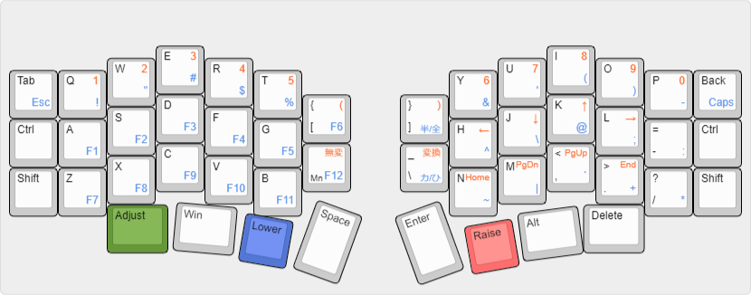

# Caravelle-BLE_keymap

Windowsの日本語キーボード設定で自作キーボードキット「[Caravelle-BLE](https://satt.booth.pm/items/1644450)」を使うためのキーマップです。  
なるべくデフォルトのキーマップに沿うよう作成しましたが、記号入力などはかなりいじっています。

 

Caravelle-BLE ビルドガイド  
https://github.com/satt99/caravelle-build-guide

画像は keyboard-layout-editor.com で作成しました。  
http://www.keyboard-layout-editor.com/#/gists/300640d79c495fccbb16387faf1e590d
